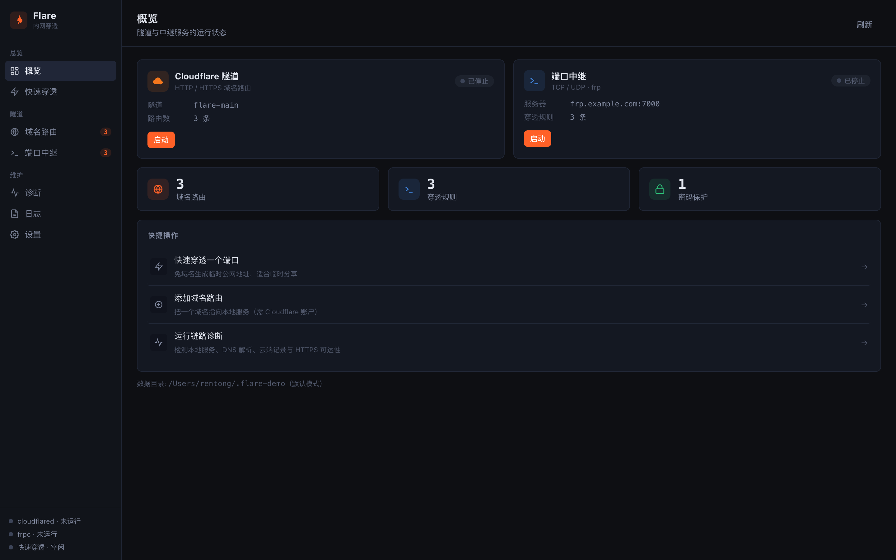
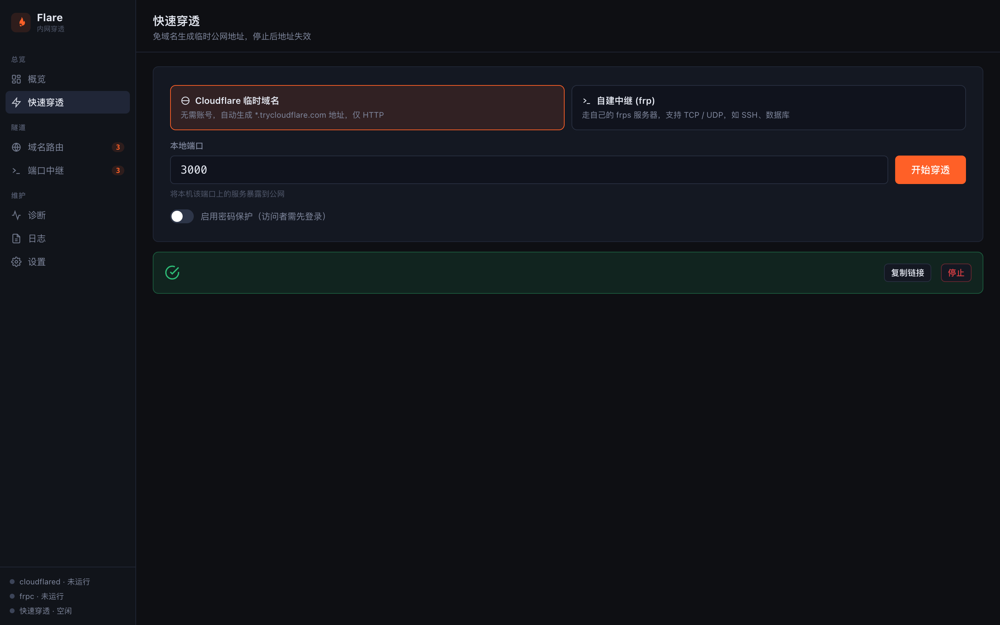
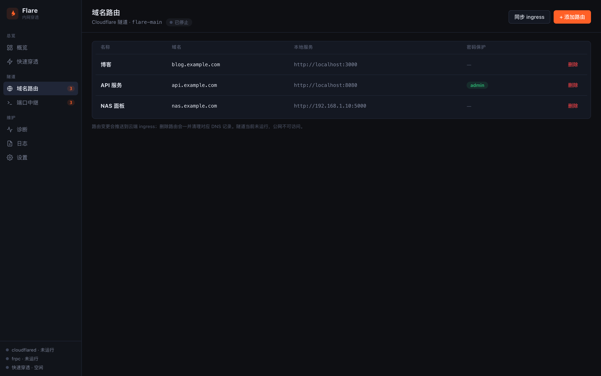
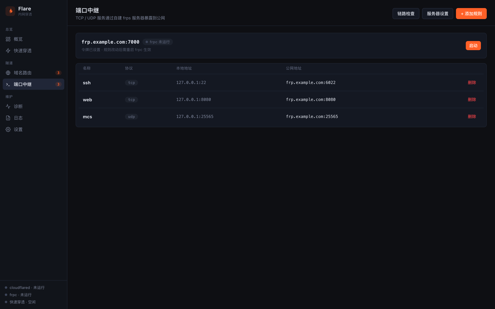
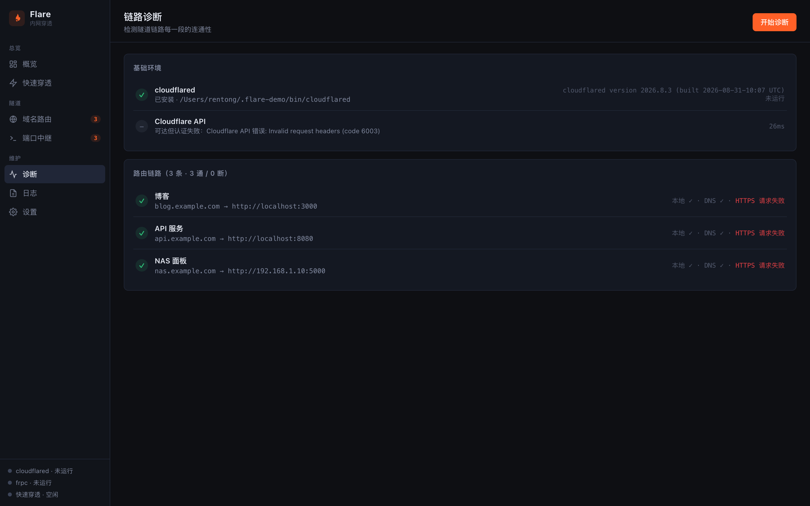
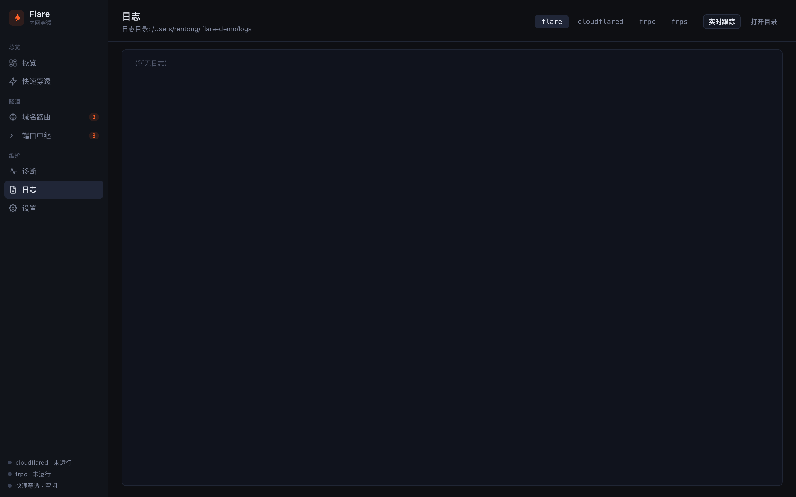
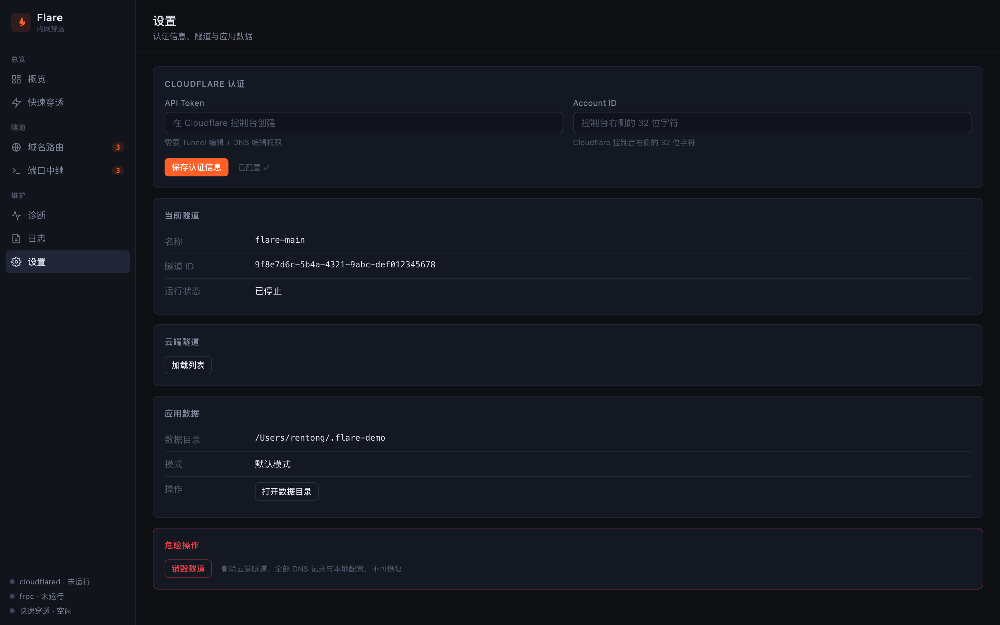

# Flare

内网穿透管理工具：Cloudflare Tunnel 域名路由 + frp 端口中继，一个面板管全部。

提供两种形态：**命令行 CLI** 和 **桌面应用（Wails）**，共享同一套 Go 核心逻辑。

## 功能一览

- **Cloudflare 隧道**：把 `blog.example.com` 这类域名指向本地服务，自动创建隧道、写 DNS 记录、推送 ingress 规则
- **快速穿透**：免配置临时公网地址（`*.trycloudflare.com`），适合临时分享本地服务；可选密码保护
- **端口中继**：通过自建 frps 服务器暴露任意 TCP/UDP 端口（SSH、游戏服、数据库…）
- **访问保护**：给任意路由/临时穿透加一层登录页（Cookie 鉴权网关）
- **链路诊断**：逐段检测 本地服务 → DNS → 云端记录 → HTTPS 可达性，哪里断了看哪里
- **日志中心**：flare / cloudflared / frpc / frps 分类日志，tail + 跟随

## 下载

| 平台 | 文件 | 说明 |
|------|------|------|
| macOS（Intel + Apple Silicon） | `Flare-macOS-universal.zip` | 解压得到 `Flare.app` |
| Windows x64 | `Flare-windows-amd64.exe` | 单文件，免安装 |

👉 **[Releases 页面下载](https://github.com/lookcorner/flare/releases/latest)**

**macOS 首次打开**：应用是自签名的，Gatekeeper 会提示"无法验证开发者"。右键 → 打开，或执行：

```bash
xattr -cr /Applications/Flare.app   # 按实际路径
```

**Windows 首次运行**：SmartScreen 点"更多信息 → 仍要运行"。运行依赖 WebView2（Win11 自带）。

## 桌面端使用

### 概览

首页展示 cloudflared 隧道和 frpc 中继两张服务卡片（运行状态、路由/规则数、启停按钮），左侧导航徽标实时显示路由与规则数量，底部常驻进程状态栏。



### 快速穿透

不需要任何账号配置，选一个模式输入本地端口即可：

- **Cloudflare 临时域名**：自动生成 `https://xxx.trycloudflare.com`，打开「密码保护」会先过一层登录页
- **frp 中继**：借用已配置的中继服务器，TCP/UDP 都行，地址即 `服务器:端口`

启动后公网地址直接显示，可一键复制；下方实时滚动 cloudflared/frpc 输出。停止即回收。



### 域名路由

把域名指到本地服务。表格列出所有路由：名称、域名、本地地址、是否带密码保护。

- **添加路由**：填域名 + 本地端口，可选登录保护 → 自动写 DNS 记录 + 推送 ingress
- **删除路由**：连同云端 DNS 记录一起清掉
- **同步 ingress**：本地路由表有改动时手动重新推送云端规则

> 需要先在「设置」页填好 Cloudflare API Token 与 Account ID，并创建隧道。



### 端口中继

通过自建 frps 服务器把本地端口映射到公网：

- **服务器设置**：填 frps 地址和 token
- **添加规则**：名称 + 协议（TCP/UDP）+ 本地端口 → 公网端口，可强制覆盖远端已占用端口
- **链路检查**：探测 frps 连通性、token 是否有效、远端端口是否被占

规则保存后点「启动」拉起 frpc，公网即可访问。



### 诊断

一键跑完整链路体检：

- **基础环境**：cloudflared 是否安装/在跑、Cloudflare API 是否可达且认证有效
- **路由链路**：每条路由分段检测——本地服务能否连上、域名 DNS 解析、云端记录是否一致、HTTPS 是否通



### 日志

四个 tab 切换 flare / cloudflared / frpc / frps 的日志，默认 tail 最近 200 行，「跟随」模式实时滚动。



### 设置

- **Cloudflare 认证**：API Token（需要 Tunnel 编辑 + DNS 编辑权限）+ Account ID（控制台右侧 32 位字符）
- **当前隧道**：名称、ID、运行状态
- **云端隧道**：列出账号下所有 Cloudflare 隧道
- **应用数据**：数据目录位置（默认 `~/.flare`，可用 `FLARE_DIR` 环境变量覆盖）
- **危险操作**：销毁隧道——删除云端隧道、全部 DNS 记录与本地配置，不可恢复



## 命令行 CLI

桌面端能做的事 CLI 全都能做（GUI 就是建立在同一套 internal 包之上）：

```bash
flare init --token <API令牌> --account <账户ID>   # 初始化认证
flare create                                     # 创建隧道
flare add web 3000 --domain blog.example.com     # 加路由
flare up / flare down                            # 启停隧道
flare fast 3000                                  # 临时穿透
flare fast 3000 --auth admin:pass                # 带密码的临时穿透
flare relay server frp.example.com:7000 --token xxx
flare relay add ssh 22 --remote 6022
flare relay up / down / check
flare diagnose                                   # 链路诊断
flare log cloudflared -f                         # 跟随日志
flare status / list / tunnels / destroy
```

CLI 编译：

```bash
go build -o flare .
```

## 从源码构建桌面端

依赖：Go ≥ 1.25 + [Wails v2 CLI](https://wails.io)（`go install github.com/wailsapp/wails/v2/cmd/wails@v2.12.0`）

```bash
cd desktop
wails dev                                    # 开发模式（前端热重载）
wails build                                  # macOS 当前架构 → build/bin/Flare.app
wails build -platform darwin/universal       # macOS 通用包
wails build -platform windows/amd64          # 交叉编译 → build/bin/Flare.exe
```

## 项目结构

```
├── main.go / cmd/          # CLI 入口与命令（Cobra）
├── internal/               # 核心逻辑：config / cfapi / daemon / relay / log / ops ...
└── desktop/                # Wails 桌面应用
    ├── app.go              # GUI 绑定层（直接调 internal/*，无子进程）
    └── frontend/           # 原生 HTML/CSS/JS
```

数据目录默认 `~/.flare/`（配置 `config.yml`、日志、cloudflared/frpc 二进制），`FLARE_DIR` 环境变量可改位置。
